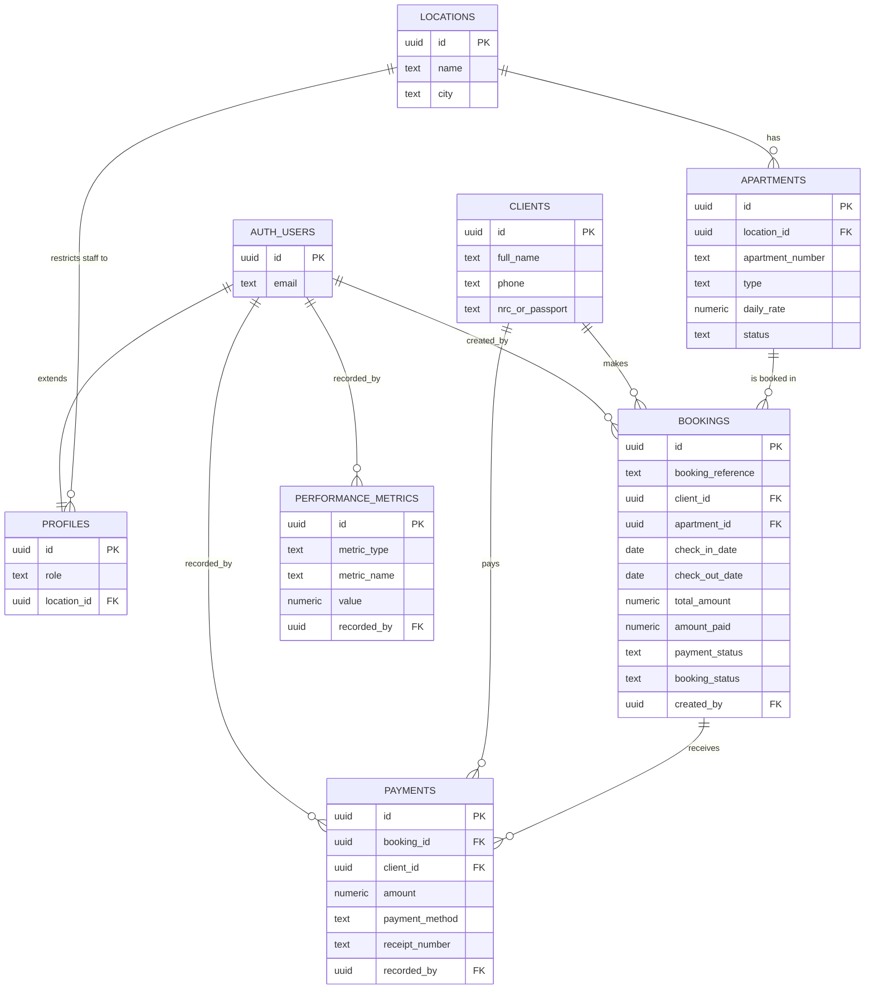

# Database Schema

Supabase Postgres. Apply in this order:

1. `supabase-schema.sql` — base tables, RLS, seed data.
2. `supabase-fixes.sql` — `next_booking_ref()`, `record_payment()`.
3. `supabase-publish-update.sql` — RLS policy update for staff-managed locations/apartments.
4. `supabase-refactor.sql` — `update_booking_status()`, the booking-overlap exclusion constraint.
5. `supabase-monitoring.sql` — `performance_metrics` table, `log_client_metric()`.
6. `supabase-hardening.sql` — revokes the implicit `PUBLIC` execute grant Postgres adds by default on `CREATE FUNCTION`, so the staff-only RPCs are no longer callable by `anon` at the grant level (their own internal checks already rejected anonymous callers; this closes the gap at the database layer too).
7. `supabase-error-logging.sql` — widens `performance_metrics.metric_type` to also accept `error`, so the React `ErrorBoundary` can report uncaught render errors through `log_client_metric()`.
8. `supabase-data-integrity.sql` — CHECK constraints on `bookings`: `check_out_date > check_in_date`, and `total_amount = rate_per_day * number_of_days`. Backstops the app's own client-side validation against a direct SQL/API write.
9. `supabase-realtime.sql` — adds `apartments` and `bookings` to the `supabase_realtime` publication, required for `subscribeToApartmentChanges()`/`subscribeToBookingChanges()` to actually receive `postgres_changes` events.

For typed access to this schema from the app, see
[src/shared/types/README.md](../src/shared/types/README.md) — types are
generated from the live database via the Supabase CLI, not hand-written.

## Entity relationship diagram

`number_of_days` and `outstanding_balance` on `BOOKINGS` are omitted above
— they're computed columns, not relationships (see below).

## Tables

### `locations`
| Column | Type | Notes |
|---|---|---|
| `id` | uuid PK | |
| `name` | text | required |
| `city` | text | |
| `created_at` | timestamptz | |

### `apartments`
| Column | Type | Notes |
|---|---|---|
| `id` | uuid PK | |
| `location_id` | uuid FK → `locations.id` | `ON DELETE CASCADE` |
| `apartment_number` | text | required |
| `type` | text | default `'Studio'` |
| `daily_rate` | numeric(10,2) | required |
| `weekly_rate`, `monthly_rate` | numeric(10,2) | optional |
| `status` | text | `available` \| `occupied` \| `maintenance` (CHECK) |
| `notes` | text | |

### `clients`
| Column | Type | Notes |
|---|---|---|
| `id` | uuid PK | |
| `full_name`, `phone` | text | required |
| `nrc_or_passport`, `email`, `company` | text | optional |

### `bookings`
| Column | Type | Notes |
|---|---|---|
| `id` | uuid PK | |
| `booking_reference` | text | unique, generated via `next_booking_ref()` |
| `client_id` | uuid FK → `clients.id` | |
| `apartment_id` | uuid FK → `apartments.id` | |
| `check_in_date`, `check_out_date` | date | required |
| `number_of_days` | integer | auto-computed: `check_out_date - check_in_date` — `GENERATED ALWAYS AS` in `supabase-schema.sql` (fresh installs); the live project this repo was refactored against computes it via a `BEFORE INSERT OR UPDATE` trigger instead (`trg_set_number_of_days` → `set_number_of_days()`), confirmed by direct introspection. Same result either way — see note below. |
| `rate_per_day`, `total_amount`, `amount_paid` | numeric(10,2) | |
| `outstanding_balance` | numeric(10,2) | auto-computed: `total_amount - amount_paid` — same generated-column-vs-trigger split as `number_of_days` (`trg_set_outstanding_balance` → `set_outstanding_balance()` on the live project). |
| `payment_status` | text | `unpaid` \| `partial` \| `paid` (CHECK) |
| `booking_status` | text | `confirmed` \| `checked_in` \| `checked_out` \| `cancelled` (CHECK) |
| `created_by` | uuid FK → `auth.users.id` | |

**Constraint (added by `supabase-refactor.sql`):** `no_overlapping_bookings` — a gist exclusion constraint on `(apartment_id, daterange(check_in_date, check_out_date, '[)'))` for any non-cancelled booking. The database rejects an overlapping insert/update outright, regardless of any client-side pre-check race. Requires the `btree_gist` extension. **Confirmed present and correct** on the live project via direct introspection.

> **Schema drift note:** the live project's `number_of_days`/`outstanding_balance` are trigger-computed, not the generated columns `supabase-schema.sql` defines — confirmed by querying `pg_trigger`/`pg_get_functiondef` directly. Both approaches produce identical values; this isn't a bug, just evidence the live database predates or diverged from the checked-in schema file at some point before this refactor. Not changed here since it means altering a live table's column definitions for no functional gain — documented as-is instead.

### `payments`
| Column | Type | Notes |
|---|---|---|
| `id` | uuid PK | |
| `booking_id` | uuid FK → `bookings.id` | |
| `client_id` | uuid FK → `clients.id` | |
| `amount` | numeric(10,2) | required, `> 0` (enforced in `record_payment()`) |
| `payment_date` | date | |
| `payment_method` | text | `cash` \| `mobile_money` \| `bank_transfer` \| `card` (CHECK) |
| `receipt_number` | text | unique, generated via `record_payment()`'s sequence |
| `recorded_by` | uuid FK → `auth.users.id` | |

### `profiles`
Extends `auth.users`. `role` (`admin` \| `employee`) and `location_id` drive Row Level Security: non-admins ("restricted" staff) only see/manage data for their assigned `location_id`.

### `performance_metrics`
| Column | Type | Notes |
|---|---|---|
| `id` | uuid PK | |
| `metric_type` | text | `web-vital` \| `query` \| `error` (CHECK) |
| `metric_name` | text | e.g. `LCP`, `CLS`, a query label like `bookings.listBookings`, or the error's `name` |
| `value` | numeric | ms for queries/most web-vitals; unitless score for `CLS`; always `1` for `error` |
| `rating` | text | `good` \| `needs-improvement` \| `poor` (CHECK) — web-vitals only, null for queries/errors |
| `path` | text | route the metric was recorded on |
| `metadata` | jsonb | e.g. `{ navigationType }` for web-vitals, `{ status }` for queries, `{ message, stack, componentStack }` for errors |
| `recorded_by` | uuid FK → `auth.users.id` | nullable — null for unauthenticated pages (login screen) |

Only `query` metrics that exceed the slow-query threshold (1000ms, see
`shared/lib/metrics.js`) are persisted here — every query firing on every
page load would be noise, not signal. See
[adr/0005-client-side-performance-monitoring.md](adr/0005-client-side-performance-monitoring.md).

## Sequences

| Sequence | Used by | Produces |
|---|---|---|
| `vkl_booking_seq` | `next_booking_ref()` | `VKL-YYYY-NNNN` booking references |
| `vkl_receipt_seq` | `record_payment()` | `RCP-YYYY-NNNN` receipt numbers |

Both are atomic (`nextval()`), so two simultaneous bookings/payments can
never collide on the same reference — this was true before the refactor
and is unchanged by it.

## Triggers

| Trigger | Table | Fires | Calls | Purpose |
|---|---|---|---|---|
| `on_auth_user_created` | `auth.users` | `AFTER INSERT` | `handle_new_user()` | Auto-creates a matching `profiles` row (`full_name`, `email` from signup metadata; `role` defaults to `'employee'`) whenever a new Supabase Auth user signs up, so every authenticated user has a profile without a separate manual step. |
| `trg_set_number_of_days` | `bookings` | `BEFORE INSERT OR UPDATE` | `set_number_of_days()` | Live-project-only (see schema drift note above) — sets `NEW.number_of_days := NEW.check_out_date - NEW.check_in_date`. `supabase-schema.sql` achieves the same via a generated column instead. |
| `trg_set_outstanding_balance` | `bookings` | `BEFORE INSERT OR UPDATE` | `set_outstanding_balance()` | Live-project-only — sets `NEW.outstanding_balance := NEW.total_amount - COALESCE(NEW.amount_paid, 0)`. Same caveat as above. |

## RPCs (`SECURITY DEFINER`, used instead of direct table writes for anything that must be atomic)

- **`next_booking_ref()`** — returns the next `VKL-YYYY-NNNN` reference from a sequence (collision-free).
- **`record_payment(p_booking_id, p_amount, p_payment_date, p_payment_method)`** — locks the booking row, validates the amount against the outstanding balance, inserts the payment, and updates `bookings.amount_paid`/`payment_status` in one transaction. Client/recorder identity is derived server-side from the booking row and `auth.uid()`, not from caller-supplied parameters.
- **`update_booking_status(p_booking_id, p_new_status, p_notes DEFAULT NULL)`** — locks the booking row, checks the caller's role/location against the booking's apartment, updates `apartments.status` and `bookings.booking_status`/`notes` together. Replaces what used to be two separate, unguarded client-side `UPDATE`s (the source of an apartment/booking status desync bug) and adds the server-side admin check that cancellation previously relied on the UI alone to enforce.
- **`log_client_metric(p_metric_type, p_metric_name, p_value, p_rating, p_path, p_metadata)`** — inserts a row into `performance_metrics`. Exists only so `recorded_by` is derived from `auth.uid()` rather than trusted from the client, and so unauthenticated callers (the login page, before any session exists) can still log a metric without an `INSERT` policy that would otherwise have to allow arbitrary anonymous writes to the table directly.

All five are `SECURITY DEFINER`, meaning they run with the privileges of
the function owner rather than the calling user — that's what lets them
do things a plain RLS policy can't (e.g. look up the caller's role from
`profiles` and conditionally allow/deny within one statement). Each
re-derives identity from `auth.uid()` server-side rather than trusting
any caller-supplied user/client ID.

**Grant hygiene:** Postgres implicitly grants `EXECUTE` to `PUBLIC` on
every `CREATE FUNCTION` unless revoked. `supabase-fixes.sql` and
`supabase-refactor.sql` only ever added an explicit `GRANT ... TO
authenticated`, never a `REVOKE ... FROM PUBLIC` — confirmed via direct
introspection that this left `next_booking_ref()`, `record_payment()`,
and `update_booking_status()` callable by the `anon` role at the grant
level (not exploitable in practice, since each immediately raises an
exception for any caller with no matching `profiles` row, which is
always true for `anon` — but grants should reflect intent regardless of
whether the function body happens to also guard it).
`supabase-hardening.sql` revokes the `PUBLIC` grant on those three and
re-asserts the `authenticated`-only grant explicitly.
`log_client_metric()` keeps its `anon` grant intentionally — the login
page needs it before any session exists.

## Row Level Security policies

RLS is enabled on every table. Full policy list:

| Table | Policy | Operation | Who | Rule |
|---|---|---|---|---|
| `locations` | `auth_read_locations` | SELECT | authenticated | `true` (read-all) |
| `locations` | `auth_manage_locations` | ALL | authenticated | admin only (`profiles.role = 'admin'`) — defined in `supabase-schema.sql`, re-created with the same rule by `supabase-publish-update.sql` (a migration-safety re-create, not a logic change) |
| `apartments` | `auth_read_apartments` | SELECT | authenticated | `true` (read-all) |
| `apartments` | `auth_manage_apartments` | ALL | authenticated | admin, **or** `apartments.location_id` matches the caller's `profiles.location_id` — lets restricted staff manage only their own location's apartments |
| `clients` | `auth_read_clients` | SELECT | authenticated | `true` (read-all) |
| `clients` | `auth_insert_clients` / `auth_update_clients` | INSERT / UPDATE | authenticated | `true` — any authenticated user can create/edit a client record (clients aren't location-scoped; a client can book at multiple locations) |
| `bookings` | `auth_read_bookings` | SELECT | authenticated | `true` (read-all; location-scoping for restricted staff is enforced in the **app layer** — see `features/*/api.js`'s `listApartmentIds`-based scoping — not in this policy) |
| `bookings` | `auth_insert_bookings` / `auth_update_bookings` | INSERT / UPDATE | authenticated | `true` — intentionally permissive at the RLS layer; status-transition authorization (e.g. "only admins can cancel") is enforced by `update_booking_status()` instead, since a row policy can't easily express "only for this specific column transition" |
| `payments` | `auth_read_payments` | SELECT | authenticated | `true` (read-all) |
| `payments` | `auth_insert_payments` | INSERT | authenticated | `true` — in practice all payment inserts go through `record_payment()`, which does the real validation (amount > 0, ≤ outstanding balance) |
| `profiles` | `auth_read_profiles` | SELECT | authenticated | `true` (read-all) |
| `profiles` | `admin_manage_profiles` | UPDATE | authenticated | admin only |
| `performance_metrics` | `admin_read_performance_metrics` | SELECT | authenticated | admin only — no `INSERT` policy at all; every write goes through `log_client_metric()` |

**Why `bookings`/`payments` read/write policies look permissive:** RLS
policies are evaluated per-row with no easy way to express "but only
through this specific RPC" or "only this column may change." Where that
kind of constraint matters (status transitions, payment amounts), it's
enforced in the `SECURITY DEFINER` RPCs above instead of in the policy —
see `docs/adr/0003-atomic-rpcs-over-multi-step-writes.md` for the
reasoning, including the bug this fixed (cancellation was previously
*only* gated by the UI hiding the option, not by RLS or any RPC).
